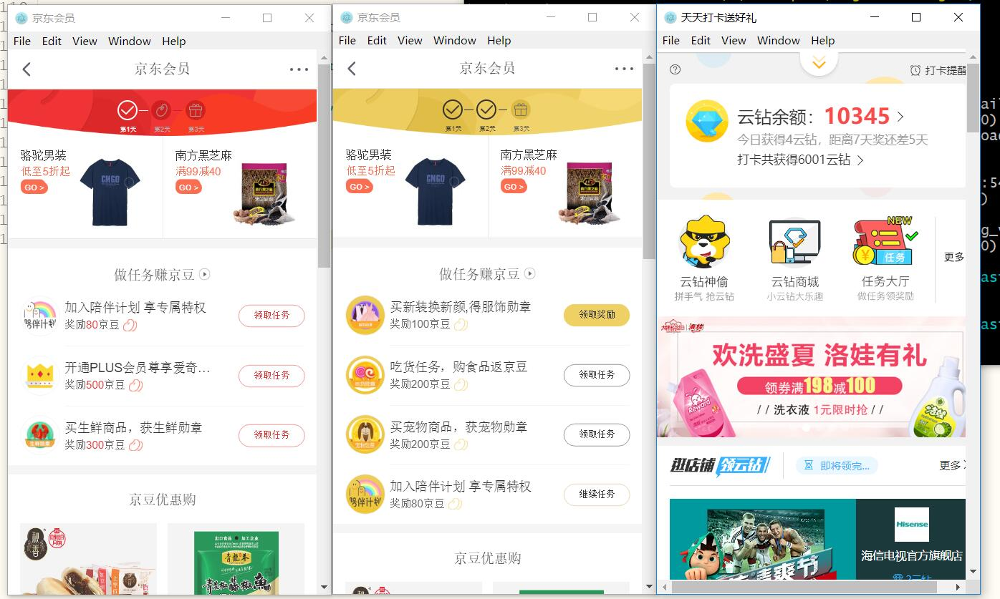

# nightmare-sign


什么值得买自动签到 ： 
> 2020年09月09日
>
> 新增一个基于谷歌无头浏览器实现的签到工程，支持smzdm签到。完全模拟人工点击。欢迎尝试。
>
> 地址：[https://github.com/xuess/puppeteer-sign](https://github.com/xuess/puppeteer-sign)


##　2018-8-30 更新

> 京东登陆删除登陆验证码，更新代码，放开京东签到功能。

##　2018-8-12 更新

> 京东登陆添加验证码，目前没办法攻克自动识别输入验证码，每次都报错发邮件，所以把京东签到暂时去掉。


基于nodejs、nightmare，京东、苏宁自动签到，自动发邮件，通知日志与报错信息

京东签到，包括小金库、京东会员、京东金融签到，苏宁就是签到领云钻。

实现背景：签到劳神，耽误大量时间，回报却很少，正如`一顿操作猛如虎，一看收益一毛五`，用脚本实现你签到领豆，解放双手。

实现原理：基于`nightmare`测试框架，编写对应脚本，实现自动签到。

项目说明：如果一直运行，本项目每天6点30分自动执行签到脚本，17点40分，发送签到日志，会把当天签到的截图发送到指定邮箱里。

喜欢请`star`，不懂的可以提问。懂的朋友，可以按照这个思路开发更多`自动签到`。

> 京东、苏宁自动签到项目：[https://github.com/xuess/nightmare-sign](https://github.com/xuess/nightmare-sign)
>
> 什么值得买自动签到项目: [https://github.com/xuess/smzdm-sign](https://github.com/xuess/smzdm-sign)


# 使用步骤

### 0.准备环境

nodejs 运行环境，注意，需要图形界面下运行
可以签到的京东和苏宁账号

### 1.填写账号以及配置信息

打开 工程文件：`./config.js`

修改如下对应代码

```javascript
	// email 登陆账号 如：xxxx@qq.com
	const emailName = 'wwww@126.com';
	// email 登陆密码 根据邮箱不同，密码可能是授权码需要注意
	const emailPassword = 'password';
	// 接收者 邮箱
	const toEmail = '10000@qq.com';
	// 账号信息
	const userData = [
		{
			type:'jd',
			username: '账号',
			password: '密码'
		},
		{
			type:'jd',
			username: '账号',
			password: '密码'
		},
		{
			type:'suning',
			username: '账号',
			password: '密码'
		},
	];
```


> 多账号添加多个变量，注意 `type`值类型，目前只有两种 `jd`和 `suning`


### 2.安装项目依赖以及执行脚本

```bash
#安装依赖
npm i  或 cnpm i

#执行 脚本
node main 

#后台运行执行脚本
nohup node main.js &

```

### 3.关于配置邮箱

配置相关代码位置：`lib/mail.js` line 11

本项目使用的是  `nodemailer` 发送邮件，如遇问题，可以搜索此关键字。

本项目中给的是`qq邮箱`，其他邮箱也是可以的。

👇给出其他邮件配置信息，可以参考一下。

```
// 邮箱支持列表
https://nodemailer.com/smtp/well-known/ 
// 邮箱配置信息 列表
https://github.com/nodemailer/nodemailer-wellknown/blob/master/services.json
```

> 注意邮箱要开启 POP3/SMTP/IMAP服务，由于第三方登陆，有些需要配置签名或授权码，登陆密码为设置的签名或授权码。


### 4.如果需要长时间运行 请用`pm2进程管理工具`

```bash
#全局安装pm2
npm i pm2 -g 

#启动签到进程
pm2 start main.js

#显示所有进程状态
pm2 list 

#监视所有进程
pm2 monit              

#显示所有进程日志
pm2 logs

```

> 关于`pm2`的详细使用介绍请看  --> [https://www.xueshanshan.com/post/node-npm-pm2.html](https://www.xueshanshan.com/post/node-npm-pm2.html)


**定时邮件 发送效果**

 

**执行过程截图**


